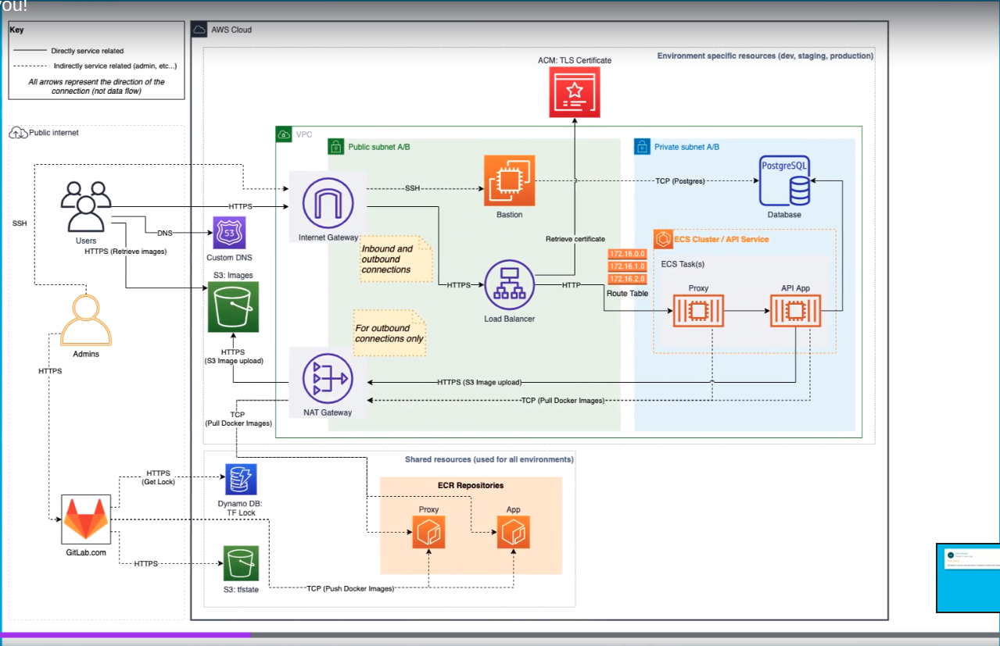

# Recipe App API DevOps Starting Point

Recipe API is a crud backend application based on

 - Python
 - Django / Django-REST-Framework
 - Docker / Docker-Compose
 - Test Driven Development

 Terraform is using this backend just to have a 'service' to deploy and build infrastruture around it

## Getting started

To start the backend project, run:

```
docker-compose up
```
if yu want to use the proxy:

```
docker-compose -f docker-compose-proxy.yml up --build
```

The API will then be available at http://127.0.0.1:8000

To get terraform started:

## AWS vault

Set up AWS vault on your local environment and create a user with the necessary permissions on AWS

## Caution 
the below commands will create infrastruture in AWS so be careful no to create unintended services and or leave services running because this might incurr unwanted monthly charges. Use the destroy command to tear down the infrastrure and manually check that all infrastrure is down, just in case something failed

## Terraform commands

### docker-compose -f deploy/docker-compose.yml run --rm terraform `<command>`

- `docker-compose -f deploy/docker-compose.yml run --rm terraform init`
- `docker-compose -f deploy/docker-compose.yml run --rm terraform fmt`
- `docker-compose -f deploy/docker-compose.yml run --rm terraform validate`
- `docker-compose -f deploy/docker-compose.yml run --rm terraform aply`
- `docker-compose -f deploy/docker-compose.yml run --rm terraform update`
- `docker-compose -f deploy/docker-compose.yml run --rm terraform destroy`

Optionally, you can use makefile commnads:

- `.PHONY: tf-init`
- `.PHONY: tf-fmt`
- ... and so on
## Workspaces 

- docker-compose -f deploy/docker-compose.yml run --rm terraform workspace list
- docker-compose -f deploy/docker-compose.yml run --rm terraform workspace new dev

## Infrastructure diagram



Each file inside deploy/ defines a different piece of the diagram suc network, database, s3, bastion, etc.


### Running on CI/CD

To run this project in gitlab (or other CI/CD enabled repo)
add the following env vriables to the CI/CD settings and mark them all as protected and masked just in case any of these get printed on the CI/CD output
- AWS_ACCESS_KEY_ID
- AWS_SECRET_ACCESS_KEY
- ECR_REPO
- TF_VAR_db_password
- TF_VAR_db_username
- TF_VAR_django_secret_key